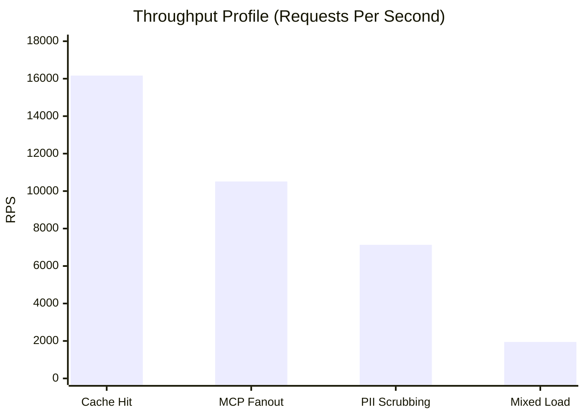
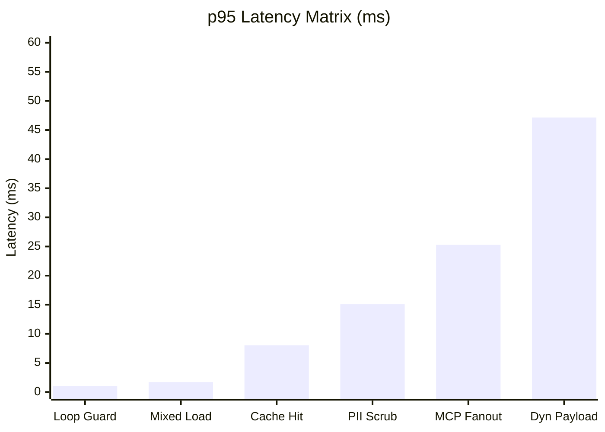

# KRYNETH GATEWAY
### Benchmark & Performance Matrix

---

## 01. EXECUTIVE SUMMARY & RAW POWER

The Kryneth Gateway is engineered to sit directly in the hot path of high-throughput LLM architectures. Leveraging Zero-Copy SIMD JSON parsing, lock-free concurrency, and asynchronous I/O via Tokio, the gateway completely eliminates Garbage Collection (GC) pauses and memory allocation overhead during request routing.

In local benchmark environments (Ubuntu/Debian, standard 2-core runner profiles), Kryneth achieves **16,000+ Requests Per Second (RPS)** with sub-millisecond core engine latency. It heavily outperforms traditional Node.js/Python based generic proxies under maximum concurrency, guaranteeing deterministic tail-latency even under extreme network saturation.

---

## 02. THROUGHPUT & LATENCY TOPOLOGY

### A. Sustained Throughput (RPS)
High-concurrency stress tests measuring absolute limits before TCP socket exhaustion.

### B. Tail Latency (p95)
Worst-case request latency (95th percentile) under continuous load simulation.

---

## 03. ARCHITECTURAL COMPLEXITY MATRIX

Engine pathways are aggressively optimized for the hardware cache-line. 

| Subsystem Path | Time Complexity (TC) | Space Complexity (SC) | Engineering Context |
| :--- | :--- | :--- | :--- |
| **Cache Hit (L1 Exact)** | `O(1)` | `O(1)` per req. | Amortized DashMap/Moka lookups directly bypassing network I/O. |
| **Loop Guard** | `O(n)` scan | `O(s)` active sessions | Sub-millisecond runtime protection utilizing localized session state. |
| **PII Scrubbing** | `O(n)` regex DFA | `O(n)` temp map | Linear deterministic finite automaton execution; fail-closed enforcement. |
| **MCP Fanout** | `O(t)` tools | `O(k)` in-flight | Bounded parallel Tokio orchestration targeting distributed tool endpoints. |
| **Dynamic Payload** | `O(n)` copy | `O(n)` arena temp | Heavy mutation paths requiring memory copies; optimized via slab allocation. |

---

## 04. THE ROAD TO ENTERPRISE SCALE

To harden the architecture for production rollout, the following chaos engineering sequences are queued:

- **Socket Exhaustion Limits:** Aggressive 500 to 1,000 VU load spike tests to benchmark raw TCP connection handling and OS file descriptor drop-rates.
- **Memory Fragmentation:** 60-minute continuous heavy payload soak tests verifying Rust's memory allocator stability without degradation.
- **Resilience Engineering:** Network failure injection (killing Redis/ClickHouse links mid-flight) to prove strict fail-open and graceful degradation compliance.
