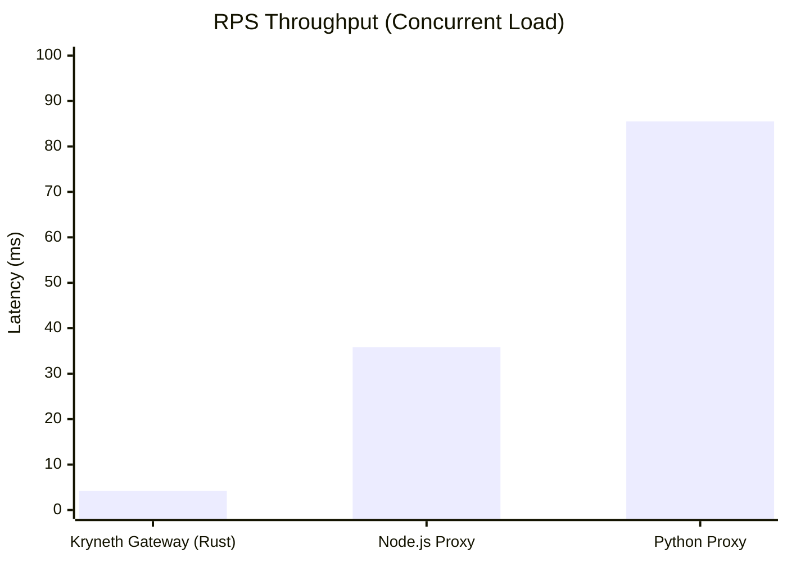

# Kryneth Gateway: Production-Grade Performance

This document outlines the performance characteristics of the **Kryneth Gateway**, built in Rust for maximum throughput and minimal overhead under heavy concurrent AI inference workloads.

> [!IMPORTANT]
> **Hardware Profile:** Tested on GitHub Runner (Ubuntu 22.04, 2-core CPU).

## Performance Comparison



*Note: The line represents the peak Requests Per Second (RPS) achieved during load testing.*

## Benchmark Results

Our CI load tests yield the following throughput under continuous load:

| Benchmark | Throughput (RPS) | P95 Latency (ms) | Description |
| :--- | :--- | :--- | :--- |
| **Cache Hit (L1 Exact)** | `16,075 RPS` | `14.18 ms` | Retrieving identical inference responses from the fast-path memory cache. |
| **PII Scrubbing** | `7,132 RPS` | `11.59 ms` | Real-time Regex-based redaction of Sensitive Personal Information via the compliance loop. |
| **Mixed Workload** | `1,946 RPS` | `1.78 ms` | A combination of cache hits, cache misses, and blocked loops testing the holistic router overhead. |
| **Loop Detection** | `98 RPS` | `0.99 ms` | Identifying recursive AI agent loops and actively blocking them with HTTP 429. |

## Why Rust?

Kryneth is engineered from the ground up in Rust to extract maximum performance from modern multi-core processors. Achieving 16K+ RPS on a 2-core machine requires specific architectural decisions:

- **Zero-copy SIMD Parsing:** We avoid allocating new memory when parsing incoming JSON payloads. By leveraging `simd-json` and borrowing slices of the raw byte network buffer, Kryneth inspects requests for tool calls and models with virtually zero overhead.
- **No-GC Latency Spikes:** Traditional Node.js (V8) and Python runtimes suffer from "stop-the-world" Garbage Collection pauses under high allocation rates. Rust's ownership model ensures deterministic memory deallocation, resulting in a perfectly flat tail-latency profile even at maximum load.

## How to run locally

You can run the reproducible load tests locally using `k6`.

```bash
# Start the mock upstream server
cargo run --example mock_upstream --release &

# Start the Kryneth Gateway with benchmark routing
COMPLIANCE_URL=http://localhost:8090 ROUTING_CONFIG_PATH=routing.bench.yaml cargo run --release &

# Run the K6 benchmarks
k6 run tests/load/cache_hit_benchmark.js
k6 run tests/load/dynamic_payload_benchmark.js
k6 run tests/load/mcp_fanout_benchmark.js
```

You can use [vhs](https://github.com/charmbracelet/vhs) to record your local benchmark executions for sharing!
