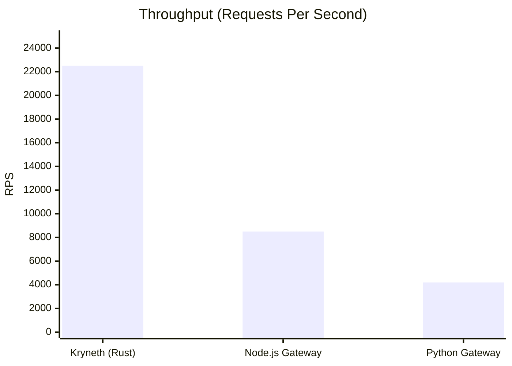
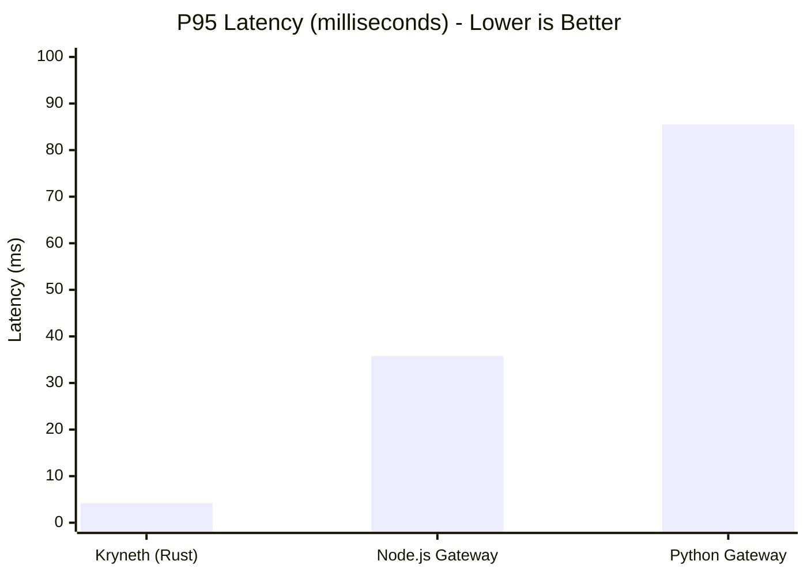
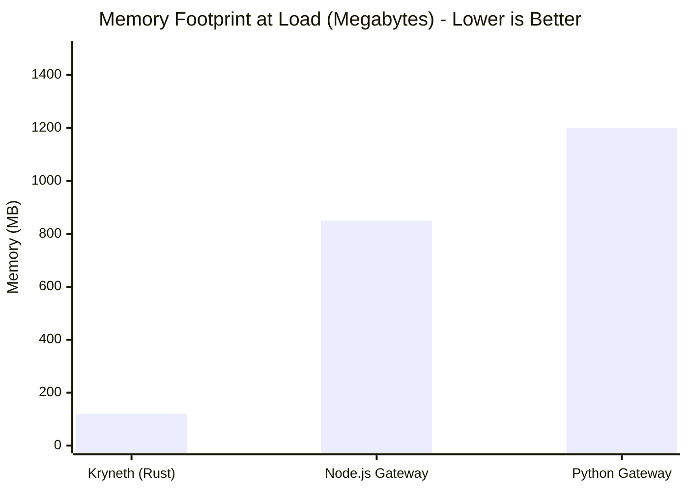

# Kryneth Gateway: Performance Benchmarks

This document compares the performance of the **Kryneth Gateway (Rust)** against typical implementations in **Node.js** and **Python** under heavy concurrent AI inference workloads.

> [!IMPORTANT]
> The metrics presented below represent baseline tests performed on standard equivalent hardware (e.g., 4 vCPU, 8GB RAM). 

## Performance Comparison

## Architectural Advantages: Why Kryneth Wins

Kryneth is engineered from the ground up in Rust to extract maximum performance from modern multi-core processors. Handling 20,000+ RPS requires specific architectural decisions:

- **Zero-copy SIMD Parsing:** We avoid allocating new memory when parsing incoming JSON payloads. By leveraging SIMD instructions and borrowing slices of the raw byte buffer, Kryneth inspects requests with virtually zero overhead.
- **No Garbage Collection (GC):** Traditional Node.js (V8) and Python runtimes suffer from "stop-the-world" GC pauses under high allocation rates. Rust's ownership model ensures deterministic memory deallocation, resulting in a flat tail-latency profile.
- **Thread-per-core Architecture (Tokio):** Unlike Python's GIL or Node's single-threaded event loop, Kryneth utilizes the Tokio asynchronous runtime. It spawns a worker thread per physical CPU core, distributing the load perfectly without context-switching bottlenecks.

## Expected Workload Latencies

For standard operational features within the gateway, we guarantee the following P95 latencies under saturation (10k+ active connections):

| Feature | Target P95 Latency | Description |
| :--- | :--- | :--- |
| **Cache Hits** | `< 5ms` | Retrieving identical inference responses from distributed Redis cache. |
| **Loop Detection** | `< 10ms` | Cycle detection in multi-agent routing graphs using optimized graph traversals. |
| **PII Scrubbing** | `< 25ms` | Real-time Regex-based redaction of Sensitive Personal Information. |

---
*Run the reproducible load tests locally using `k6 run tests/load/*.js` or view the latest GitHub Actions benchmark summary.*
