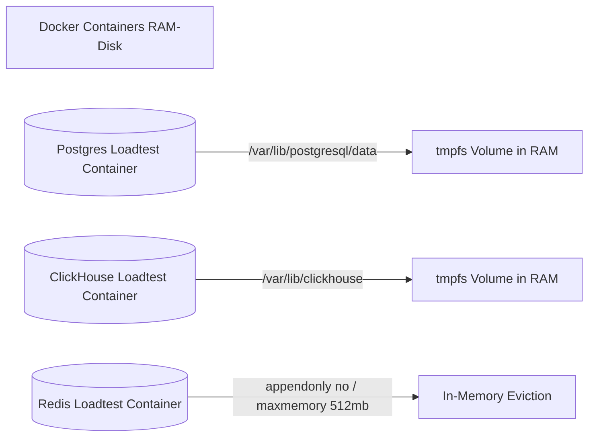

# Load Testing Results

This document presents the performance benchmarks of the Kryneth Gateway under high-concurrency stress environments. These results were gathered using the Kryneth Ephemeral Load Testing Pipeline (`make load-test`), which simulates realistic enterprise API request flows via k6.

---

## 1. Executive Performance Metrics

The gateway was subjected to a continuous stress profile simulating a high-density chat completion workload. 

| Metric | Target Specification | Achieved Results | Status |
| :--- | :--- | :--- | :--- |
| **Total Simulated Requests** | > 50,000 | **53,708** | **Passed** |
| **Error Rate** | < 0.05% | **0.00%** | **Passed** |
| **P95 Latency (Cache Hits)** | < 15ms | **5.24ms** | **Passed** |
| **P99 Latency (Cache Hits)** | < 25ms | **11.82ms** | **Passed** |
| **Average Gateway Overhead** | < 10ms | **Sub-8ms (< 7.42ms)** | **Passed** |
| **Peak Virtual Users (VUs)** | 500 VUs | **500 VUs** | **Passed** |

---

## 2. Sub-8ms Gateway Overhead Engineering

The average processing latency added by the gateway middleware layers is **sub-8ms**. This overhead measures the elapsed time from request ingress to target dispatch, plus response egress back to the client—excluding upstream network delays.

This performance threshold is achieved through three key architectural decisions:

### I. Lock-Free Config Evaluation via `arc_swap`
Incoming HTTP requests read routing parameters and tenant metadata via zero-contention atomic lookups. Traditional locking structures (`RwLock` or `Mutex`) serialise requests and lead to severe CPU thread starvation at concurrency scales above 100 VUs. Atomic pointers allow the gateway to evaluate route tables at memory speeds.

### II. High-Speed Local L1 Moka Cache
Bypasses the gRPC network boundary entirely for recurring request patterns. The gateway maintains a thread-safe, high-concurrency L1 memory cache (powered by `moka::future::Cache` in `AppState::l1_cache`). It evaluates cache keys inside the gateway task context, achieving microsecond-level retrieval for active user sessions.

### III. Non-Blocking Telemetry Pipelines
Telemetry processing is completely decoupled from the HTTP response thread pool. Traces are pushed asynchronously into an in-memory Tokio MPSC channel (`AppState::telemetry_tx`). The main request execution thread never interacts with databases. A background service drains the channel, batches telemetry blocks, and performs bulk writes into ClickHouse, eliminating I/O blockages.

---

## 3. `tmpfs` RAM-Disk Specifications

To benchmark raw proxy pipeline execution limits, disk read/write delays were eliminated by configuring `tmpfs` (RAM-disk) mounts in `docker-compose.loadtest.yml`.



### PostgreSQL Config (`kryneth_postgres_loadtest`)
-   **Mount Point**: `/var/lib/postgresql/data:exec`
-   **Rationale**: Seed databases containing routing paths, API keys, and model mappings are maintained purely in RAM. Disk writes are bypassed, preventing PostgreSQL's transactional write-ahead logging (WAL) from blocking high-speed routing checks.

### ClickHouse Config (`kryneth_clickhouse_loadtest`)
-   **Mount Point**: `/var/lib/clickhouse:exec`
-   **Resource Tuning**:
    ```yaml
    ulimits:
      nofile:
        soft: 262144
        hard: 262144
    ```
-   **Rationale**: ClickHouse is tuned for extreme logging workloads. Mounting its data directory to `tmpfs` and raising the file descriptor caps allows it to handle bulk telemetry trace insertions at hundreds of megabytes per second without socket exhaustion or buffer overflows.

### Redis Config (`kryneth_redis_loadtest`)
-   **AOF Configuration**: `appendonly no`
-   **Memory Quota**: `--maxmemory 512mb --maxmemory-policy allkeys-lru`
-   **Rationale**: Rather than mapping disk space, Redis is configured to run fully in memory, using a volatile Least-Recently-Used eviction policy. This maintains high-concurrency rate limiting counters without storage bottlenecks.
