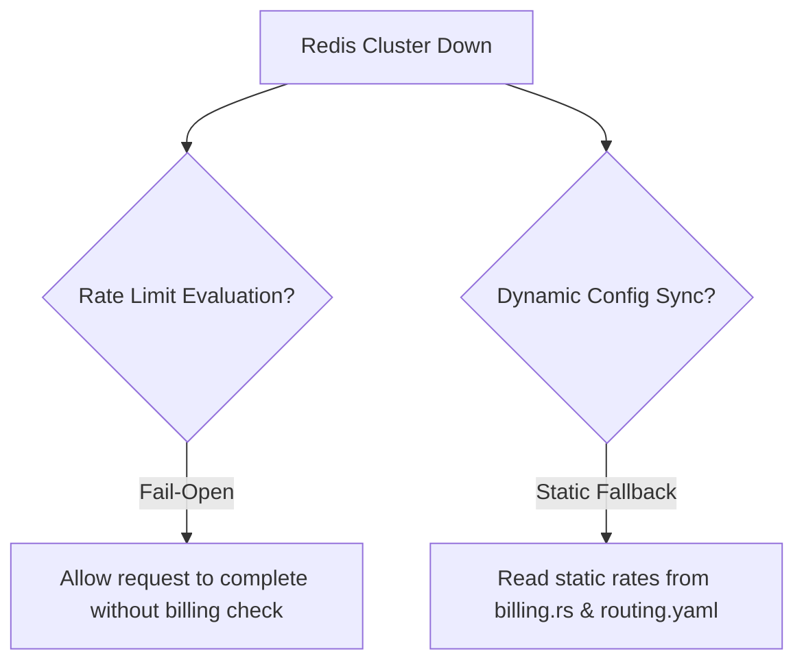

# Disaster Recovery & High Availability (HA)

This runbook details disaster recovery strategies, recovery processes, and architectural failover postures for the Kryneth Gateway cluster when key supporting systems degrade.

---

## 1. REDB WAL Corruption Recovery

The gateway microservice writes telemetry data locally to an embedded Write-Ahead Log (WAL) database powered by `redb` at the configured `REDB_TELEMETRY_WAL_PATH` (default: `./data/telemetry_wal.redb`).
Under unexpected host failures or hard resets, this WAL file can become corrupted, resulting in startup crashes or file locking errors (e.g. `DatabaseError::Corruption`).

### Symptoms
*   The gateway logs exit codes or crash loops with messages like:
    ```text
    FATAL: Failed to initialize telemetry WAL database: Corruption(...)
    ```
*   File locking errors indicating the `.redb` lock cannot be acquired.

### SRE Recovery Runbook
If a telemetry WAL file is corrupted, follow these steps to recover the service:

1.  **Stop the degraded gateway instance**:
    ```bash
    kubectl scale deployment kryneth-gateway --replicas=0 -n kryneth
    ```
2.  **Verify Volume Mounts**: Locate the persistent volume mapping to the WAL directory (e.g., `/app/data/`).
3.  **Execute Truncation/Deletion**:
    Since `redb` acts as a transient Write-Ahead Log (data is drained asynchronously to ClickHouse), it is safe to delete the file. Historic data is already written to ClickHouse.
    ```bash
    rm /app/data/telemetry_wal.redb
    ```
4.  **Restart the gateway**: Scale the deployment back to restore pods. The service will automatically initialize a fresh, empty WAL file on boot.
    ```bash
    kubectl scale deployment kryneth-gateway --replicas=3 -n kryneth
    ```

---

## 2. Redis Degradation & HA Failures

In Kryneth Enterprise clusters, Redis tracks rate limits, billing balances, and configuration updates. SREs must configure appropriate failover modes when Redis goes offline or degrades:



### Rate Limiting (Fail-Open Policy)
If connection attempts to the Redis cluster time out or yield connection errors, Kryneth's rate limit middleware switches to **Fail-Open**:
-   **Why**: Rather than blocking user API traffic during a Redis degradation event, Kryneth continues proxying requests to upstream LLMs.
-   **Warning**: During Redis outages, sliding-window rate limit caps and token burn-rates cannot be tracked. Tenants may temporarily exceed their limits.

### Dynamic Config Fallback
If Redis goes down, dynamic configuration updates via Pub/Sub will fail. The gateway uses the following fallbacks:
-   **Routing**: Continues using the active in-memory routing snapshot currently loaded in `arc_swap`.
-   **Cold Start Fallback**: If a gateway pod starts up while Redis is offline and Postgres is unreachable, it falls back to the static `routing.yaml` config file and the precautionary rates hardcoded in `billing.rs`.

---

## 3. OPA & Presidio Fail-Closed Security Posture

Kryneth Gateway treats security and compliance dependencies (Open Policy Agent (OPA) for RBAC firewall checks, and Presidio for PII scrubbing) as **Zero-Trust Boundaries**. These services enforce a **Fail-Closed** security posture.

> [!CAUTION]
> **Fail-Closed Policy Enforcement:**
> If the OPA server or Presidio gRPC backend is unreachable, the gateway rejects the request immediately with an **`HTTP 500 Internal Server Error`** or **`HTTP 403 Forbidden`**. Clean traffic is never allowed to bypass compliance layers if the validator goes offline.

### Docker Compose Reference (OPA & Presidio Sidecars)
Use this sidecar configuration template to ensure high availability and low latency for the compliance services:

```yaml
version: '3.8'

services:
  # Open Policy Agent (OPA) Sidecar
  opa:
    image: openpolicyagent/opa:latest-static
    container_name: kryneth-opa
    ports:
      - "8181:8181"
    command:
      - "run"
      - "--server"
      - "--addr=:8181"
      - "--log-format=json"
    resources:
      limits:
        cpu: "0.5"
        memory: "256Mi"
      requests:
        cpu: "0.1"
        memory: "128Mi"

  # Presidio gRPC PII Extraction Engine
  presidio:
    image: mcr.microsoft.com/presidio-analyzer:latest
    container_name: kryneth-presidio-grpc
    ports:
      - "50052:50052"
    environment:
      - PORT=50052
      - GRPC_PORT=50052
    resources:
      limits:
        cpu: "1.0"
        memory: "1Gi"
      requests:
        cpu: "0.2"
        memory: "512Mi"
```
