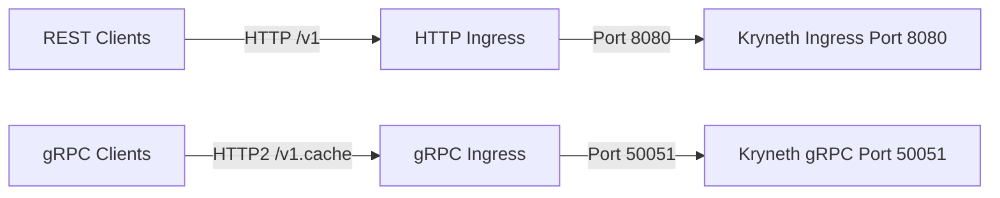

# Kubernetes Deployment & Ingress

Deploying Kryneth Gateway to Kubernetes (EKS, GKE, AKS) ensures high-availability, auto-scaling, and secure multi-port routing.

In production architectures, the gateway manages two distinct traffic paths:
1.  **L7 REST Traffic (HTTP)**: Serves completions proxy requests, config updates, and analytics queries on **Port `8080`**.
2.  **L2 Semantic Cache (gRPC/HTTP2)**: Relies on `kryneth_cache` running on **Port `50051`** to perform semantic vector lookups via gRPC.

---

## 1. Multi-Port Kubernetes Service

To expose both endpoints within the cluster, configure a single Service exposing both the HTTP web port and the gRPC data port:

```yaml
apiVersion: v1
kind: Service
metadata:
  name: kryneth-gateway
  namespace: kryneth
  labels:
    app: kryneth-gateway
spec:
  selector:
    app: kryneth-gateway
  ports:
  - name: http
    port: 80
    targetPort: 8080
    protocol: TCP
  - name: grpc
    port: 50051
    targetPort: 50051
    protocol: TCP
```

---

## 2. NGINX Ingress Controller Routing (gRPC vs HTTP)

To route external cluster traffic to both ports using the **NGINX Ingress Controller**, you must define separate Ingress resources. This is because gRPC routing requires specific HTTP2 and protocol headers that differ from standard HTTP/1.1 REST parameters.



### A. HTTP REST Ingress
Exposes standard completion API endpoints on port `8080`:

```yaml
apiVersion: networking.k8s.io/v1
kind: Ingress
metadata:
  name: kryneth-http-ingress
  namespace: kryneth
  annotations:
    kubernetes.io/ingress.class: "nginx"
    nginx.ingress.kubernetes.io/ssl-redirect: "true"
    nginx.ingress.kubernetes.io/proxy-read-timeout: "600"
spec:
  rules:
  - host: api.kryneth.tech
    http:
      paths:
      - path: /
        pathType: Prefix
        backend:
          service:
            name: kryneth-gateway
            port:
              name: http
```

### B. gRPC Cache Ingress
Exposes the distributed cache endpoint on port `50051`. Notice the **`backend-protocol: "GRPC"`** annotation, which instructs NGINX to open an HTTP2 upstream connection instead of upgrading HTTP/1.1:

```yaml
apiVersion: networking.k8s.io/v1
kind: Ingress
metadata:
  name: kryneth-grpc-ingress
  namespace: kryneth
  annotations:
    kubernetes.io/ingress.class: "nginx"
    nginx.ingress.kubernetes.io/ssl-redirect: "true"
    # CRITICAL: Tells the Ingress controller to negotiate via HTTP2 / gRPC protocol
    nginx.ingress.kubernetes.io/backend-protocol: "GRPC"
spec:
  rules:
  - host: cache.kryneth.tech
    http:
      paths:
      - path: /
        pathType: Prefix
        backend:
          service:
            name: kryneth-gateway
            port:
              name: grpc
```

---

## 3. Gateway Deployment Manifest

```yaml
apiVersion: apps/v1
kind: Deployment
metadata:
  name: kryneth-gateway
  namespace: kryneth
  labels:
    app: kryneth-gateway
spec:
  replicas: 3
  strategy:
    type: RollingUpdate
    rollingUpdate:
      maxSurge: 1
      maxUnavailable: 0
  selector:
    matchLabels:
      app: kryneth-gateway
  template:
    metadata:
      labels:
        app: kryneth-gateway
    spec:
      containers:
      - name: kryneth-gateway
        image: krynethgw/kryneth-gateway:latest
        ports:
        - name: http
          containerPort: 8080
        - name: grpc
          containerPort: 50051
        env:
        - name: PORT
          value: "8080"
        - name: CACHE_GRPC_PORT
          value: "50051"
        - name: RUST_LOG
          value: "info"
        resources:
          requests:
            cpu: 200m
            memory: 256Mi
          limits:
            cpu: 500m
            memory: 512Mi
        livenessProbe:
          httpGet:
            path: /health
            port: http
          initialDelaySeconds: 10
          periodSeconds: 30
```
