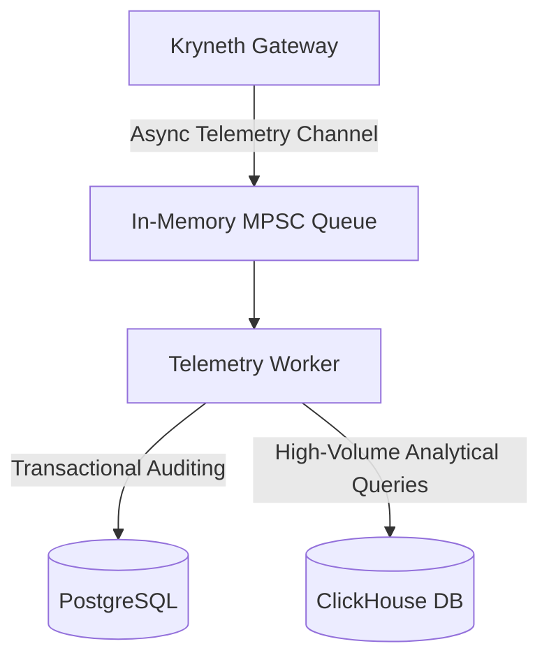

# Enterprise Billing Engine

Kryneth Enterprise incorporates a high-accuracy, low-overhead token metering and pricing engine designed to track LLM expenditures across complex multi-tenant environments.

---

## 1. Token Metering Pipeline

To measure usage without blocking the request pipeline:
1.  During request proxying, Kryneth counts input and output tokens using a high-speed token counter (`tiktoken-rs`).
2.  The token metrics, paired with the active model's pricing rules, determine the financial cost of the transaction.
3.  The gateway writes these billing transactions asynchronously to the `kryneth_tracer` queue, preventing DB delays from increasing client latencies.

---

## 2. Distributed Ledger Storage

Billing records are split across two dedicated systems for auditing and analytics:

### PostgreSQL (Transactional)
-   Stores exact tenant credit balances and ledger bills.
-   Handles real-time spending limit queries.

### ClickHouse (Analytical)
-   Ingests bulk token traces for high-volume analysis.
-   Powers dashboard reports and usage graphs.

---

## 3. Configuration Reference

Configure these environment variables in your deployment setup:

| Env Variable | Requirement | Default | Description |
| :--- | :--- | :--- | :--- |
| `DATABASE_URL` | **Required** | *Empty* | Connection string to the PostgreSQL cluster (e.g. `postgresql://...`). |
| `CLICKHOUSE_URL` | **Required** | *Empty* | Connection string to the ClickHouse analytics server (e.g. `http://...`). |
