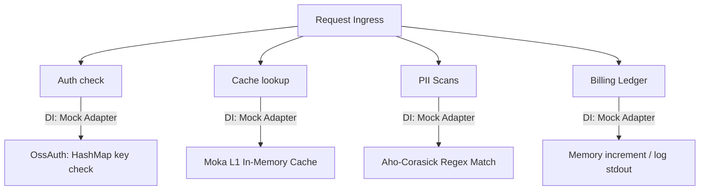

# Standalone Mode & Local Mocking

Standalone mode boots Kryneth Gateway without external database dependencies (PostgreSQL, Redis, ClickHouse) or compliance sidecars (OPA, Presidio). It is intended for rapid local development loops, integration testing, and low-latency edge deployments.

---

## 1. Zero-Dependency Local Architecture

Running Postgres, Redis, ClickHouse, OPA, and Presidio locally consumes significant CPU and memory. To enable friction-less developer onboarding, Kryneth uses **Dependency Injection (DI)** at compile-time to swap concrete production database clients with lightweight, high-performance in-memory mock adapters.



### Mock Adapters in `oss_adapters.rs`
The file **[oss_adapters.rs](file:///d:/Kryneth-Gateway-OSS/src/infrastructure/oss_adapters.rs)** implements the core traits required by the gateway using transient in-memory structures:

*   **`OssBilling`**: Bypasses the PostgreSQL billing ledger. It evaluates cost models in memory and writes transaction lines directly to `stdout` logs instead of pushing to an external queue.
*   **`OssTelemetry`**: Bypasses the ClickHouse analytical pipeline. It serializes traces to standard JSON logs and prints them to `stdout`, allowing developers to read telemetry via console output.
*   **`MockPresidio`**: Bypasses the python-based Presidio gRPC container. It executes a fast regex and Aho-Corasick word match locally on the request thread.

Because all operations run in memory without network hops, standalone mode processes requests with an internal gateway latency of **under 1.5ms**.

---

## 2. Launching Standalone Mode

To execute Kryneth Gateway in standalone mode:

1.  Create a local **`routing.yaml`** configuration file in the root of the workspace.
2.  Set the environment configuration and boot using Cargo:

```bash
# Set valid API keys to authenticate client requests
export KRYNETH_VALID_KEYS="sk-test-12345,sk-test-67890"

# Boot the gateway
cargo run --release
```

The gateway will automatically detect the absence of `DATABASE_URL` or `REDIS_URL` and bind the `OssBilling` and `OssTelemetry` adapters dynamically.

---

## 3. Configuration Reference

Configure these environment variables to adjust standalone behavior:

| Env Variable | Requirement | Default | Description |
| :--- | :--- | :--- | :--- |
| `KRYNETH_VALID_KEYS` | **Required** | *Empty* | Comma-separated list of client API keys authorized to route through the gateway. |
| `PORT` | **Optional** | `8080` | Port to expose the HTTP proxy. |
| `ROUTING_CONFIG_PATH` | **Optional** | `./routing.yaml` | Path to the local static YAML routing file. |
