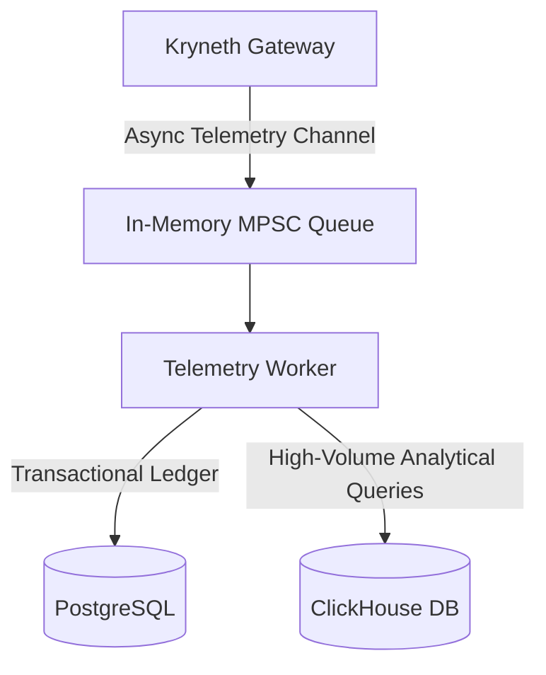

# Enterprise Billing & Metering Engine

Kryneth Enterprise incorporates a high-accuracy, low-overhead token metering and pricing engine designed to track LLM expenditures across complex multi-tenant environments. It enforces strict cost tracking, applies cache-hit discount rates, and features defensive ceilings to prevent billing runaway.

---

## 1. The Token Metering Pipeline

To measure usage without blocking the request pipeline, Kryneth splits metrics collection and financial calculations into a dual transactional/analytical architecture:



1.  **On-Path Tokenization**: During request proxying, Kryneth counts input and output tokens using a high-speed token counter (`tiktoken-rs`).
2.  **Ledger Storage**: Billing records are written asynchronously to the `kryneth_tracer` queue, preventing database write delays from blocking client completions.
    -   **PostgreSQL**: Stores exact tenant credit balances, ledger transactions, and performs real-time limit checks.
    -   **ClickHouse**: Ingests bulk token traces for high-volume analysis and dashboard reports.

---

## 2. Samalikkira Buffer (Defensive Ceiling)

In production environments, developers or upstream providers might route traffic to undocumented or newly released "zero-day" models. If the pricing engine fails to recognize a model, billing records could fail-open (billing $0.00 for massive queries), leading to severe financial losses due to Denial of Wallet (DoW) attacks.

To prevent this, Kryneth enforces the **Samalikkira Buffer**:
-   **Defensive Ceiling Rates**: Any unknown or unlisted model/provider automatically defaults to the Premier Defensive Ceiling:
    -   **Input Cost**: **$20.00** per 1,000,000 (1M) tokens.
    -   **Output Cost**: **$60.00** per 1,000,000 (1M) tokens.
-   **Philosophy**: Kryneth chooses to over-estimate costs rather than under-bill, protecting the gateway host from runaway API bills.

---

## 3. Model-Specific Pricing & Cache Hit Discounts

Completions costs are calculated dynamically based on provider-specific models. Furthermore, Kryneth detects caching events and applies real-time input token discounts.

### DeepSeek Cache Hit Discount Logic
DeepSeek models offer significant discounts for input tokens that hit the context cache. Kryneth's billing engine detects cache hits and applies these discounts dynamically:

*   **DeepSeek Chat / V3**:
    -   **Standard Input**: $0.14 per 1M tokens.
    -   **Cache Hit Input**: Drops to **$0.014** per 1M tokens (10x discount).
*   **DeepSeek R1**:
    -   **Standard Input**: $0.55 per 1M tokens.
    -   **Cache Hit Input**: Drops to **$0.14** per 1M tokens.

### Rust Implementation contract
The mathematical logic protecting against floating-point anomalies (NaN/Infinity) is implemented in `calculate_cost_safe` within the billing engine:

```rust
// kryneth_gateway_enterprise/src/usecases/billing_engine.rs
let input_cost_per_1m = if is_cache_hit {
    if (rate_rule.input_cost_per_1m - 0.14).abs() < f64::EPSILON {
        0.014 // DeepSeek V3 cache hit
    } else if (rate_rule.input_cost_per_1m - 0.55).abs() < f64::EPSILON {
        0.14  // DeepSeek R1 cache hit
    } else {
        rate_rule.input_cost_per_1m
    }
} else {
    rate_rule.input_cost_per_1m
};
```

---

## 4. Static Pricing Fallback (Source of Truth)

While Enterprise deployments dynamically load pricing maps from Postgres/Redis, the gateway contains a static, hardcoded pricing registry inside the OSS core. 

The Rust file **[billing.rs](file:///d:/Kryneth-Gateway-OSS/src/domain/billing.rs)** acts as the **single source of truth** for all static precautionary rates. When Redis is down or during cold-starts, `lookup_precautionary_rate` is invoked to map providers to their standard rates.

---

## 5. Configuration Reference

| Env Variable | Requirement | Default | Description |
| :--- | :--- | :--- | :--- |
| `DATABASE_URL` | **Required** | *Empty* | Connection string to the PostgreSQL cluster. |
| `CLICKHOUSE_URL` | **Required** | *Empty* | Connection string to the ClickHouse analytics server. |
