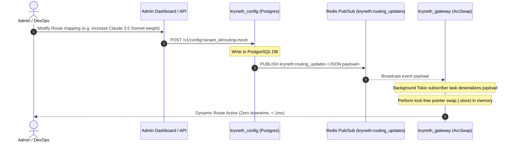

# Dynamic Routing Configuration & Hot-Swaps

In large-scale agent deployments, upstream LLM routing tables change dynamically due to provider rate-limit exhaustion, model deprecations, or server failures. Restarting API gateway instances to reload static YAML files is unacceptable as it terminates active client connections and spikes latency.

Kryneth Gateway solves this by decoupling the routing mesh from static files. It uses a dynamic, distributed **Control Plane synchronization mechanism** that pushes updates via Redis and hot-swaps memory configurations in under **1ms** without thread-locking or downtime.

---

## 1. Architecture Flow

Dynamic routing updates flow through a unidirectional, event-driven control plane:



---

## 2. Dynamic DB & Redis Sync Engine

The control plane microservice (`kryneth_config`) acts as the dynamic state compiler.
*   **Database Source of Truth**: All tenant configurations, physical endpoints, virtual models, and api-key bindings are stored in PostgreSQL.
*   **Active Sync Channel**: When an administrator triggers a routing-mesh recompile or config change, `kryneth_config` queries the db tables, merges active routes, and publishes a JSON payload to the Redis channel:
    ```text
    kryneth:routing_updates
    ```

### Sample Wire Format Event
This JSON payload is sent over Redis Pub/Sub to signal routing updates to all gateway nodes:

```json
{
  "11111111-2222-3333-4444-555555555555": {
    "llama-3.3-70b": {
      "rate_limit_rpm": 600,
      "targets": [
        {
          "priority": 1,
          "weight": 100,
          "api_key_alias": "primary-groq",
          "api_key": "sk_groq_prod_12345",
          "provider_name": "groq",
          "base_url": "https://api.groq.com/openai/v1",
          "target_model": "llama-3.3-70b-versatile",
          "schema_format": "openai"
        }
      ]
    }
  }
}
```

---

## 3. Lock-Free Memory Mutation via ArcSwap

In high-concurrency Rust services, wrapping the routing state in a standard mutex or read-write lock (`std::sync::RwLock` or `tokio::sync::RwLock`) introduces major lock contention. Under heavy load, readers (requests being routed) block writers (configuration updates), leading to tail-latency spikes (P99 spikes).

To achieve zero-downtime hot-swaps, Kryneth uses the `arc_swap` crate to implement **Lock-Free Read-Mostly Pointers**:

### Rust Implementation Details
The gateway maintains the global configuration state inside an `ArcSwap<HashMap<String, HashMap<String, ModelConfig>>>`:

```rust
// kryneth_gateway_enterprise/src/infrastructure/config_subscriber.rs
// Deserializes and stores new config atomically
let current_guard = state.state.load();
let mut merged = (**current_guard).clone();

for (tenant_id, model_map) in delta_config {
    merged.insert(tenant_id, model_map);
}

// Atomically swap the pointer
state.state.store(Arc::new(merged));
```

-   **Reader Performance ($O(1)$ Load)**: Incoming proxy threads read from the configuration by calling `state.state.load()`. This operation is lock-free, utilizing atomic pointer loads that execute in CPU registers. It adds zero thread contention.
-   **Writer Safety**: When the background Redis Pub/Sub task receives a `kryneth:routing_updates` event, it clones the existing map, writes the changes, and calls `.store(...)` to swap the pointer. The old map is automatically cleaned up and dropped as soon as all active request threads finish using their references.
