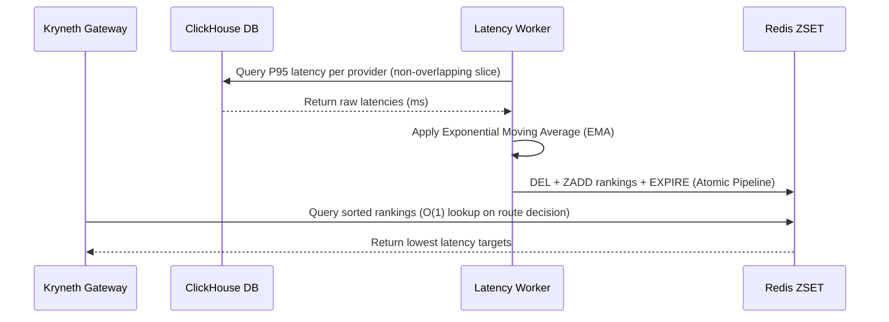

# EMA Latency Routing

In multi-tenant, high-traffic agent systems, routing requests to high-latency or degraded upstream model providers (e.g. during groq or Anthropic outages) severely hurts agent execution speeds. If a provider's P95 latency spikes, your agent workflow will lag, accumulating operational bottlenecks.

Kryneth Gateway incorporates an automated background **EMA Latency Routing Engine** that monitors upstream provider velocities in real time and ranks them, allowing the L7 router to select the lowest-latency active provider in **O(1) time**.

---

## 1. The Latency Ranking Pipeline

Rather than computing latency checks on the hot request path, Kryneth offloads metrics gathering and calculations to an asynchronous worker loop:



### ClickHouse Ingestion Scoping (Zero-Overlap Reads)
-   The `LatencyWorker` wakes up periodically (default: every `10` seconds).
-   On each tick, it queries ClickHouse using a non-overlapping SQL time window:
    ```sql
    SELECT
        executed_provider,
        quantile(0.95)(latency_ms) AS p95
    FROM Kryneth_telemetry.request_logs
    WHERE created_at >= now() - INTERVAL 10 SECOND
      AND status = 200
      AND executed_provider != ''
    GROUP BY executed_provider
    ```
-   **Performance Optimization**: By scoping the query window exactly to the worker's tick interval, the database avoids reading duplicate historic logs, eliminating CPU spikes under heavy analytics load.

---

## 2. Exponential Moving Average (EMA) Smoothing

To prevent sudden transient network spikes from permanently biasing route decisions, Kryneth applies an **Exponential Moving Average (EMA)** smoothing algorithm to the raw ClickHouse observations:

$$\text{EMA}_{\text{new}} = \alpha \cdot \text{Raw}_{\text{P95}} + (1 - \alpha) \cdot \text{EMA}_{\text{previous}}$$

*   **Alpha ($\alpha$)**: Defaults to `0.3`. A higher alpha biases the metric towards recent spikes; a lower alpha maintains stable long-term history.
*   **Cold Start**: If no previous EMA exists for a provider, the raw P95 latency is used as the initial baseline.
*   **Cardinality Cap**: Tracks a maximum of `64` unique provider endpoints to prevent unbounded in-memory state growth.

---

## 3. High-Speed Redis ZSET Serialization

After calculating the EMAs, the worker writes the ranked providers to a Redis Sorted Set (ZSET) at the key **`kryneth:latency:rankings`**.
*   **Atomic Replacement**: The worker sends a pipelined batch (`DEL` -> `ZADD` -> `EXPIRE`) to Redis to prevent routing inconsistencies.
*   **Self-Expiring TTL**: The rankings ZSET is configured with a 30-second Time-To-Live (TTL). If the latency worker crashes, the rankings automatically expire, forcing the gateway to fall back to static priority chains rather than using stale metrics.
*   **Gateway O(1) Fetch**: When a client requests completion with latency-priority routing (`x-kryneth-routing-strategy: latency-priority`), the gateway performs a fast `ZRANGE` or `HGET` on the ZSET, resolving the optimal target provider in under **0.5ms**.

---

## 4. Configuration Reference

Configure these environment variables in your deployment setup:

| Env Variable | Requirement | Default | Description |
| :--- | :--- | :--- | :--- |
| `LATENCY_WORKER_INTERVAL_SECS` | **Optional** | `10` | Frequency in seconds at which the background latency worker checks ClickHouse logs. |
| `TRACER_URL` | **Optional** | `http://localhost:8082` | HTTP endpoint of the tracer service. |
