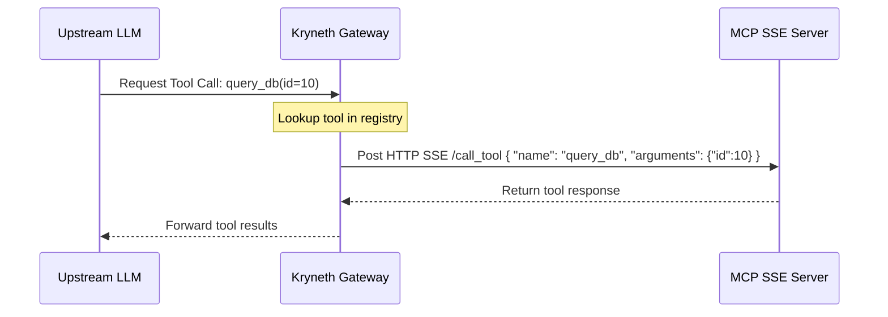
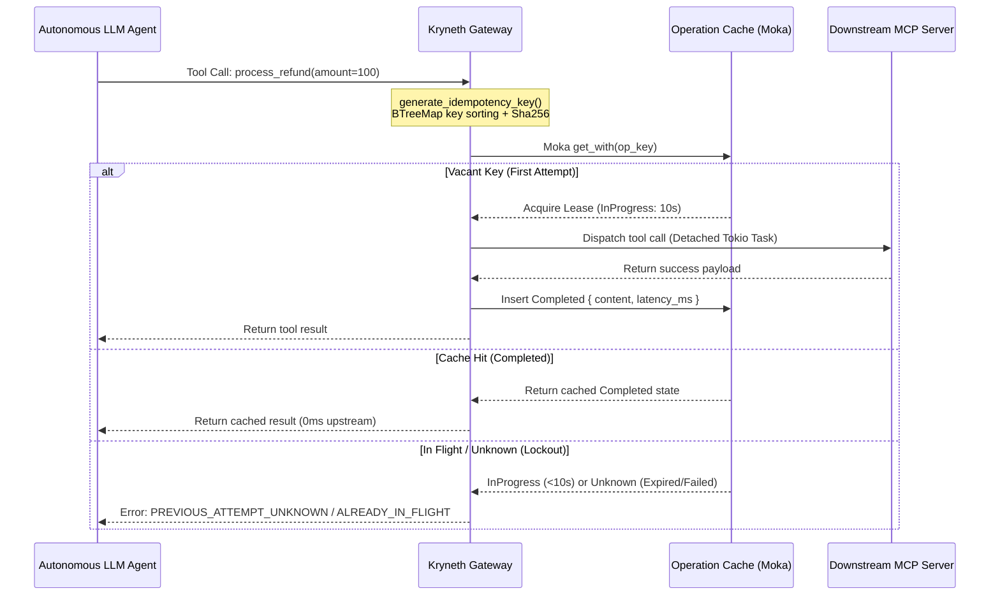

# Model Context Protocol (MCP) Router

To securely connect autonomous LLM agents with local databases, tools, or internal APIs, Kryneth incorporates an MCP router ("Tunnel 3"). It translates LLM tool call schemas into Model Context Protocol invocations, routing them over Server-Sent Events (SSE).

---

## 1. Zero-Copy Routing & Tool Execution

When an upstream LLM decides to trigger a tool, it issues a standard tool call payload. Kryneth intercepts this payload, translates the request structure, and executes the tool over the SSE tunnel.



---

## 2. Practical MCP Registry Configuration

Connected MCP servers are registered dynamically using the **`MCP_TOOL_REGISTRY`** environment variable or via the configuration control plane. 

### `MCP_TOOL_REGISTRY` Environment Variable Format
This variable must contain a valid JSON object mapping tool names directly to their SSE endpoint URLs:

```json
{
  "fetch_customer_data": "http://localhost:9000/sse",
  "execute_sql_query": "http://localhost:9000/sse",
  "send_slack_alert": "http://slack-mcp.internal.net/sse"
}
```

*   **Mapping Rule**: Multiple tools can map to the same SSE endpoint (e.g. `fetch_customer_data` and `execute_sql_query` both hit the same server instance at `:9000/sse`).

---

## 3. Python-Based MCP SSE Server Example

Below is a complete, lightweight Python-based MCP server using the official `mcp` SDK, exposing an SSE connection endpoint that Kryneth can query.

### Installation
```bash
pip install mcp[cli] fastapi uvicorn
```

### Server Implementation (`server.py`)
```python
import uvicorn
from fastapi import FastAPI
from mcp.server.fastapi import QueueServer
from mcp.types import Tool, TextContent

app = FastAPI(title="Kryneth Custom MCP Server")
# Create the MCP QueueServer runner
mcp_server = QueueServer(name="custom-db-tools")

# Register tools exposed to the gateway
@mcp_server.list_tools()
async def handle_list_tools() -> list[Tool]:
    return [
        Tool(
            name="fetch_customer_data",
            description="Fetches basic client profile data by customer ID.",
            inputSchema={
                "type": "object",
                "properties": {
                    "customer_id": {"type": "string", "description": "UUID string of the target customer"}
                },
                "required": ["customer_id"],
            }
        )
    ]

# Handle execution requests forwarded by Kryneth
@mcp_server.call_tool()
async def handle_call_tool(name: str, arguments: dict) -> list[TextContent]:
    if name == "fetch_customer_data":
        cust_id = arguments.get("customer_id")
        # In a real app, query database here
        mock_profile = f"Customer Profile for {cust_id}: Status=Active, Tier=Enterprise"
        return [TextContent(type="text", text=mock_profile)]
    raise ValueError(f"Tool {name} not found")

# Bind the MCP SSE routes to FastAPI
mcp_server.link_to_fastapi(app, sse_path="/sse", messages_path="/messages")

if __name__ == "__main__":
    uvicorn.run(app, host="0.0.0.0", port=9000)
```

---

## 4. Bounded Concurrency & Hard Timeouts

To prevent the gateway from locking up during high-velocity parallel tool calls, Kryneth applies strict execution boundaries:
*   **Bounded Parallel Fan-out**: Outbound tool executions are capped at a maximum of **10 parallel requests** (`futures::stream::buffer_unordered(10)`) per agent session. This avoids overloading local network interfaces or downstream services.
*   **Per-Call Timeout**: Every outbound tool invocation has a hard **5-second timeout**. If a tool fails to resolve in 5 seconds, it is terminated and returns a structured error:
    ```json
    { "error": "MCP_TIMEOUT" }
    ```
    This ensures that slower or hung tool calls do not block other concurrent tool executions.

---

## 5. Merge Schema Format

Upon completing tool runs, Kryneth gathers the responses into a standardized JSON array format before passing them back to the upstream LLM:
```json
[
  {
    "tool": "fetch_customer_data",
    "result": { "text": "Customer Profile for 123: Status=Active, Tier=Enterprise" },
    "latency_ms": 142,
    "success": true
  }
]
```
If a tool returns non-JSON raw text, Kryneth sanitizes and binds it under a standard `"text"` JSON key to maintain schema validity.

---

## 6. Two-Phase Semantic Lazy Schema Loading

Autonomous agent setups often load massive schemas containing descriptions and parameter formats for hundreds of tools. This "MCP Tax" exhausts LLM context windows and spikes token consumption.

To solve this, Kryneth implements a **Two-Phase Semantic Lazy Schema Loading** system:
1.  **Phase A (Lazy Injection)**: The gateway intercepts outgoing `tools` definitions. It strips out the massive `parameters` block, replacing it with a single semantic description line. This reduces context window token load significantly (e.g. from 300 to 15 tokens per tool definition).
2.  **Phase B (Schema on Demand)**: If the LLM requests detailed parameters for a tool, Kryneth intercepts the query, injects the parameters block back in from the local schema cache, and feeds it to the LLM.

---

---

## 7. Semantic MCP Idempotency & Safe Retry Engine

In high-velocity autonomous agent workflows, network blips, LLM retries, or execution timeouts can cause an agent to re-issue identical tool calls. Without strict idempotency controls, executing non-idempotent tool mutations (such as processing refunds, placing trades, or modifying database records) twice risks financial loss or state corruption.

Kryneth Gateway incorporates an in-memory **Semantic MCP Idempotency & Safe Retry Engine** to guarantee exact-once tool execution semantics across active sessions.



### Deep Canonicalization (`generate_idempotency_key`)
To prevent minor formatting variations (such as reordered JSON key-value pairs) from evading idempotency detection, Kryneth applies deep structural canonicalization:
* **Key Sorting via `BTreeMap`**: The `canonicalize_json` helper recursively converts JSON objects into sorted `BTreeMap` representations.
* **Deterministic Hashing**: Computes a SHA-256 hash over the canonical key string:
  $$\text{IdempotencyKey} = \text{SHA-256}(\text{tenant\_id} \parallel \text{"::"} \parallel \text{tool\_name} \parallel \text{"::"} \parallel \text{canonical\_args\_json})$$

### The `OpState` State Machine & Stampede Prevention
Kryneth tracks pending and completed tool operations in `AppState::operation_cache` using the `OpState` enum:

```rust
pub enum OpState {
    InProgress { lease_until: std::time::Instant },
    Completed { content: String, latency_ms: u64 },
    Unknown,
}
```

* **TOCTOU Thundering Herd Lock (`Moka get_with`)**: When a tool call arrives, Kryneth invokes Moka's atomic `.get_with()` async closure. If vacant, the current thread atomically acquires a **10-second lease lock** (`OpState::InProgress`). Concurrent duplicate requests arriving while the operation is in flight receive an immediate `{"error":"ALREADY_IN_FLIGHT"}` response without hitting downstream MCP servers.
* **Detached Task Execution**: The actual tool invocation runs inside a detached `tokio::spawn` task. Even if the client disconnects or times out at the HTTP level, the background task completes, saving the `OpState::Completed` result for subsequent agent retries.

### Safe Retry Lockout & LLM Hallucination Guard
If a prior tool execution timed out or panicked, its state resolves to `OpState::Unknown` (or its lease lock expires). 
* **Safe Retry Lockout**: When an agent attempts to re-execute a tool whose state is `Unknown`, Kryneth returns `{"error":"PREVIOUS_ATTEMPT_UNKNOWN"}` rather than re-running the tool. This prevents secondary non-idempotent side effects when state is uncertain.
* **LLM Hallucination Guard**: Kryneth's response formatter explicitly filters raw retry error strings before constructing the final prompt context, preventing LLM reasoning loops from hallucinating fake database states or repeating failed actions based on internal gateway error payloads.

---

## 8. TOON (Tabular Object-Oriented Notation) Tool Response Compression

When MCP tools query databases or APIs, they frequently return arrays containing hundreds of homogeneous JSON objects. Passing raw JSON arrays back to the LLM exhausts token budgets through repeated key definitions (`"id":`, `"name":`, `"status":`).

To eliminate this token overhead, Kryneth includes a **TOON Tool Response Compression** engine.

### Homogeneous Array Compression (`convert_to_toon`)
When tool response compression is enabled, Kryneth automatically parses outgoing tool response arrays. If the payload is a homogeneous JSON array of objects, `convert_to_toon` converts it into compact header-and-row tabular notation:

```text
array[3]{customer_id,status,tier}: 
 CUST-101,Active,Enterprise 
 CUST-102,Pending,Standard 
 CUST-103,Active,Enterprise
```

* **Token Savings**: Reduces response token consumption by **40% to 70%** compared to verbose JSON array structures while preserving full semantic readability for LLM attention heads.
* **Heterogeneous Safety**: If the array contains non-object items, irregular fields, or varying key counts, Kryneth automatically falls back to raw JSON without breaking downstream parser expectations.

### Safe AST Metadata Stripping (`strip_non_essential_metadata`)
During lazy schema loading, Kryneth applies AST-level stripping via `strip_non_essential_metadata` to strip non-essential descriptive clutter from JSON parameters:
* **Stripped Fields**: Removes `description`, `title`, and `examples` fields recursively from parameter object trees.
* **Preserved Structural Schema**: Strictly preserves `type`, `properties`, `required`, and `enum` blocks, keeping parameter validation boundaries fully intact while eliminating documentation text overhead.

---

## 9. Configuration Reference

Configure these environment variables in your deployment setup:

| Env Variable | Requirement | Default | Description |
| :--- | :--- | :--- | :--- |
| `MCP_TOOL_REGISTRY` | **Required** | *Empty* | JSON object mapping tool names directly to their SSE endpoint URLs. |
| `MCP_TOOL_SCHEMA_REGISTRY` | **Optional** | *Empty* | JSON array containing tool descriptors and schema structures for lazy loading. |

