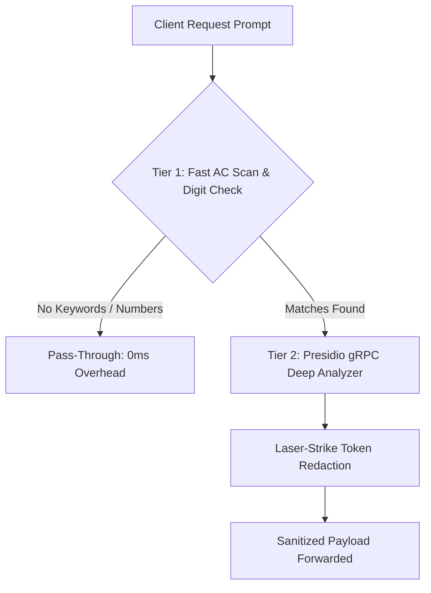

# PII Protection & Residency Compliance

Autonomous AI agents frequently process sensitive user inputs. Without strict safety filters, agents can accidentally leak personally identifiable information (PII) to public third-party LLMs or store sensitive customer data across geographic borders, violating global regulations like **GDPR** or India's **DPDP**.

Kryneth Gateway incorporates an automated pre-flight security scanner that redacts PII, blocks prompt injections, and steering-routes traffic to satisfy strict sovereign data residency bounds before request payloads leave your infrastructure.

---

## 1. Two-Tier PII Redaction Engine

To protect user confidentiality with minimal latency overhead, Kryneth processes completions through a specialized **Two-Tier Redaction Engine**:



### Tier 1: Fast-Path Keyword Scan
-   **Automaton**: Uses a high-speed `Aho-Corasick` search structure to scan prompts for PII indicators (e.g. `aadhaar`, `ssn`, `credit card`, `pan card`, `@`).
-   **Digit Sequences**: Scans for sequences of 9 or more consecutive numbers (potential bank accounts, credit cards, or ID numbers).
-   **Performance**: If no keywords or numbers match, Tier 2 is bypassed entirely, adding **0ms** processing latency to clean requests.

### Tier 2: Deep-Path Entity Extraction
-   **Analyzer**: If Tier 1 flags a potential match, the engine calls a `PresidioAnalyzer` gRPC backend to isolate exact byte offsets of sensitive entities.
-   **Laser-Strike Redaction**: Replaces each detected entity with a UUID-tagged token (e.g., `<SSN_REDACTED>_b86fc469`).
-   **JSON Hygiene (replacen fix)**: Rather than performing a global substring replacement which could corrupt unrelated integers or parts of the JSON payload, Kryneth only replaces the *first* matching occurrence per string node, safeguarding payload structural integrity.
-   **Token Map**: Stores the mapping (`Token` -> `Original Value`) in Redis so the gateway can de-tokenize the prompt downstream when processing upstream LLM output.

---

## 2. Dynamic Geo-Routing & Residency (DPDP India)

To satisfy sovereign data boundaries, Kryneth intercepts incoming client requests, resolves user locations, and steering-routes traffic accordingly.

### Region Resolution
Kryneth determines the caller's region using a priority-ordered fallback chain:
1.  **`x-user-region`** (Priority 1) — Manually injected by DPDP-aware client applications.
2.  **`x-enforce-region`** (Priority 2) — Configured via tenant-level workspace settings.
3.  **IP Geo-IP Lookup** (Priority 3) — Resolves the caller's origin country based on the client IP header `x-forwarded-for`.

### Sovereign Enforcement (DPDP)
*   If the user's region resolves to **`IN`** (India), the gateway injects the `x-kryneth-allowed-regions: in` header and directs the completion request to the dedicated local sovereign endpoint (`in_endpoint`).
*   **Region Lock**: If an Indian user requests a model restricted to US infrastructure (specifically `o1-preview` or `o1-mini`), the gateway blocks the request immediately with an **`HTTP 403 Forbidden`** response:
    ```json
    {
      "error": "Compliance or Security Violation",
      "reason": "Model 'o1-preview' is restricted to US infrastructure and cannot be accessed from region IN (DPDP compliance)"
    }
    ```

---

## 3. Local Prompt Injection Guard

Before OPA or PII evaluation, Kryneth executes a pattern-matching filter to intercept jailbreak attempts:
*   Blocks common prompt-injection vectors (e.g. `ignore previous instructions`, `you are now acting as`, `jailbreak`, `system prompt bypass`).
*   Returns an HTTP 403 response locally, preventing LLM token consumption for malicious payloads.

---

## 4. Configuration Reference

Configure these environment variables in your deployment setup:

| Env Variable | Requirement | Default | Description |
| :--- | :--- | :--- | :--- |
| `COMPLIANCE_URL` | **Optional** | `http://localhost:8083` | HTTP endpoint of the compliance microservice. |
| `VITE_USE_MOCK_DATA` | **Optional** | `false` | Instructs the dashboard to display mock analytics if ClickHouse is offline. |
