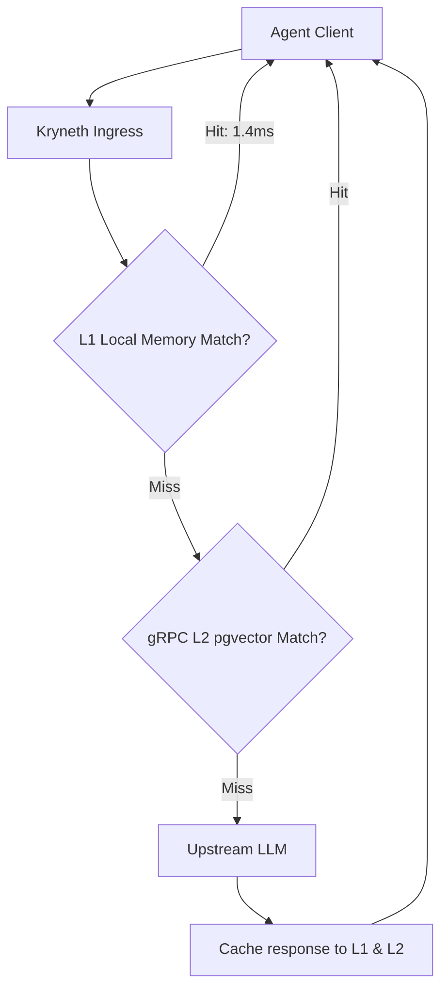

# Hybrid L1/L2 Semantic Caching

To reduce token charges and decrease response latency, Kryneth Gateway processes queries through a multi-tier semantic cache layer. Hits are returned in **~1.4ms** directly from memory.

---

## 1. Cache Levels & Tenant Isolation

### L1 Local Cache (In-Memory)
-   **Structure**: Relies on transient, high-performance in-memory cache buckets (`Moka` and `DashMap`).
-   **Function**: Houses recent exact matches and vectorized embeddings locally, bypassing external checks entirely.

### L2 Clustered Cache (gRPC Distributed)
-   **Structure**: Offloads cache misses to a centralized `kryneth_cache` microservice over low-latency gRPC.
-   **Function**: Computes cosine-similarity semantic vector matches using `pgvector` stored in PostgreSQL. If a prompt falls within the confidence bounds, the cached response is served.



### Tenant Isolation
To prevent cross-customer data leakage, all cache lookup and storage operations are strictly tenant-isolated. Cache keys in both local memory and the distributed L2 database are prefixed with the active tenant's UUID (`tenant_id`).

---

## 2. Adaptive Similarity Thresholds

For semantic matches (computed via BAAI/bge-small-en-v1.5 embeddings), Kryneth dynamically sets cosine distance thresholds based on prompt length:
*   **Short Prompts (<= 8 words)**: Evaluates with a strict distance threshold of **`< 0.06`** to prevent false-positive associations.
*   **Longer Prompts (> 8 words)**: Evaluates with a relaxed distance threshold of **`< 0.14`**.

---

## 3. Pre-flight Intent Verification

Before finalizing a semantic match, Kryneth executes an interrogatives scan:
*   It analyzes both the incoming prompt and the cached prompt for structural matching of question tokens (`what`, `who`, `where`, `when`, `why`, `how`, `can`, `is`, `do`, `does`).
*   If the interrogative intents do not match (e.g., comparing a statement with a question), the gateway forces a cache miss, ensuring correct semantic matching.

---

## 4. Memory Safety Constraints

To protect resources from Out-Of-Memory (OOM) failures under massive payload loads:
*   **100KB Payload Cap**: Kryneth enforces a strict 100KB ceiling for response strings inserted into the L2 semantic RAM cache. Responses larger than 100KB are bypass-logged and not cached.
*   **Moka Weigher Bounding**: Local L1 cache entries are bound by a byte-capacity weigher:
    ```rust
    .weigher(|k, v| (k.len() + v.len() + 64) as u32)
    ```

---

## 5. Configuration Reference

Configure these environment variables in your deployment setup:

| Env Variable | Requirement | Default | Description |
| :--- | :--- | :--- | :--- |
| `CACHE_GRPC_ENDPOINT` | **Optional** | `http://localhost:50051` | gRPC endpoint of the L2 semantic cache microservice. |
| `CACHE_TTL_SECS` | **Optional** | `60` | Duration in seconds before cache entries are marked stale. |
| `L1_CACHE_SIZE` | **Optional** | `10000` | Maximum number of vector and response entries allowed in the local Moka cache. |
