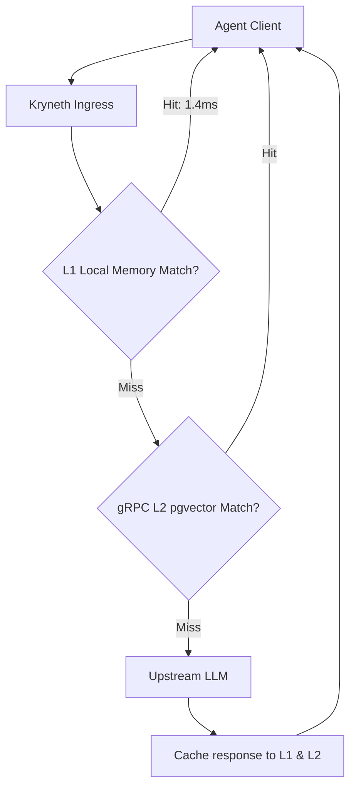
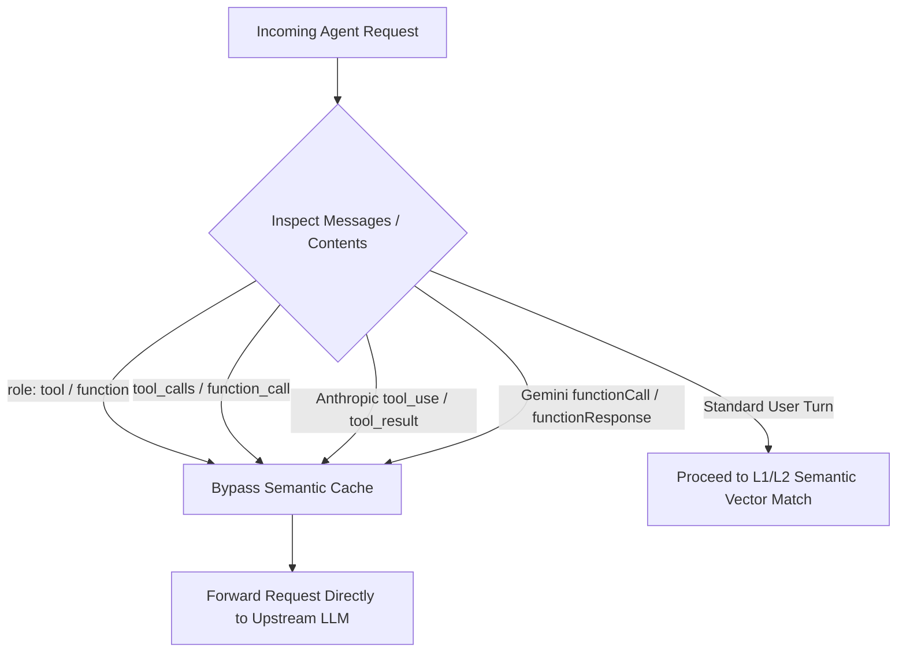

# Hybrid L1/L2 Semantic Caching

To reduce token charges and decrease response latency, Kryneth Gateway processes queries through a multi-tier semantic cache layer. Hits are returned in **~1.4ms** directly from memory.

---

## 1. Cache Levels & Tenant Isolation

### L1 Local Cache (In-Memory)
-   **Structure**: Relies on transient, high-performance in-memory cache buckets (`Moka` and `DashMap`).
-   **Function**: Houses recent exact matches and vectorized embeddings locally, bypassing external checks entirely.

### L2 Clustered Cache (gRPC Distributed)
-   **Structure**: Offloads cache misses to a centralized `kryneth_cache` microservice over low-latency gRPC.
-   **Function**: Computes cosine-similarity semantic vector matches using `pgvector` stored in PostgreSQL. If a prompt falls within the confidence bounds, the cached response is served.



### Tenant Isolation
To prevent cross-customer data leakage, all cache lookup and storage operations are strictly tenant-isolated. Cache keys in both local memory and the distributed L2 database are prefixed with the active tenant's UUID (`tenant_id`).

---

## 2. Adaptive Similarity Thresholds

For semantic matches (computed via BAAI/bge-small-en-v1.5 embeddings), Kryneth dynamically sets cosine distance thresholds based on prompt length:
*   **Short Prompts (less than or equal to 8 words)**: Evaluates with a strict distance threshold of `< 0.06` to prevent false-positive associations.
*   **Longer Prompts (greater than 8 words)**: Evaluates with a relaxed distance threshold of `< 0.14`.

---

## 3. Pre-flight Intent Verification

Before finalizing a semantic match, Kryneth executes an interrogatives scan:
*   It analyzes both the incoming prompt and the cached prompt for structural matching of question tokens (`what`, `who`, `where`, `when`, `why`, `how`, `can`, `is`, `do`, `does`).
*   If the interrogative intents do not match (e.g., comparing a statement with a question), the gateway forces a cache miss, ensuring correct semantic matching.

---

---

## 4. Multi-Turn Agentic Cache Bypass

In multi-turn agentic conversations, an agent moves through iterative reasoning steps:
1. User provides initial prompt: `"Analyze customer retention for Q3"`.
2. Assistant issues tool call: `tool_calls: [fetch_customer_data]`.
3. System returns tool response: `role: "tool"`, `content: "Retention rate is 84%"`.
4. Assistant executes next reasoning turn or completes the request.

### The Infinite Cache-Hit Trap
Because OpenAI, Anthropic, and Gemini wire conversation history by re-sending the initial user prompt on every turn, naive vector embedding lookups land on the user prompt text. Without intelligent bypass logic, `extract_semantic_text` would extract the same user text, compute an identical 384-dim BGE vector, and match the initial turn 1 response (`dist=0.0000, sim=1.0000`). This traps the agent in an **infinite cache-hit loop**, where the gateway returns turn 1's initial assistant payload over and over, preventing the agent from receiving tool results or progressing to subsequent reasoning steps.

### Multi-Ecosystem Detection (`extract_semantic_text`)
Kryneth solves this by inspecting incoming request payloads using a single-pass reverse walk over the conversation history (`extract_semantic_text` in `usecases/proxy.rs`). When active agentic tool execution markers are detected, Kryneth automatically returns `None`, bypassing L1/L2 semantic cache lookup:



### Supported Provider Tool Markers
Kryneth normalizes tool detection across all supported provider formats:
* **OpenAI & Groq**: Detects `role: "tool"`, `role: "function"`, assistant `tool_calls` arrays, or `function_call` fields.
* **Anthropic Messages API**: Detects `type: "tool_use"` content blocks in assistant messages or `type: "tool_result"` blocks in user response messages.
* **Google Gemini**: Detects `functionCall` or `functionResponse` fields within `contents[*].parts`.

> [!NOTE]
> **What is NOT bypassed**: 
> - **L1 Exact Match Cache**: Keyed on the SHA-256 hash of the entire raw JSON payload. Because message arrays append tool outputs on each turn, raw JSON hashes differ every turn, preventing exact-match collisions.
> - **PII Redaction Scan (`extract_semantic_text_raw`)**: Intentionally remains active during tool turns because tool outputs (e.g., SQL query results or customer profiles) are primary vectors for sensitive data ingestion.

---

## 5. Memory Safety Constraints

To protect resources from Out-Of-Memory (OOM) failures under massive payload loads:
*   **100KB Payload Cap**: Kryneth enforces a strict 100KB ceiling for response strings inserted into the L2 semantic RAM cache. Responses larger than 100KB are bypass-logged and not cached.
*   **Moka Weigher Bounding**: Local L1 cache entries are bound by a byte-capacity weigher:
    ```rust
    .weigher(|k, v| (k.len() + v.len() + 64) as u32)
    ```

---

## 6. Configuration Reference

Configure these environment variables in your deployment setup:

| Env Variable | Requirement | Default | Description |
| :--- | :--- | :--- | :--- |
| `CACHE_GRPC_ENDPOINT` | **Optional** | `http://localhost:50051` | gRPC endpoint of the L2 semantic cache microservice. |
| `CACHE_TTL_SECS` | **Optional** | `60` | Duration in seconds before cache entries are marked stale. |
| `L1_CACHE_SIZE` | **Optional** | `10000` | Maximum number of vector and response entries allowed in the local Moka cache. |

