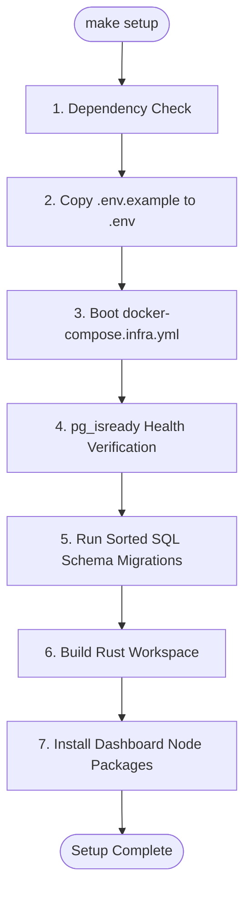

# Local Stack Setup & Onboarding

Welcome to the Kryneth developer onboarding guide. This guide explains how to boot up and run the entire Kryneth L7 API Gateway and Policy Engine workspace locally.

The Kryneth project is configured with a unified `Makefile` that orchestrates compilation, environmental variables, Docker infrastructure, database schema migrations, and frontend assets.

---

## 1. System Requirements

Before beginning the golden path onboarding, ensure the following core tools are installed on your system (WSL2 Linux environment recommended on Windows):

- **Docker & Docker Compose** (engine v20.10+)
- **Rust Toolchain** (v1.75+ including `cargo`)
- **Node.js** (v18+ and `npm`)

---

## 2. One-Click Installation (`make setup`)

To initialize your development workspace from scratch, execute the setup command in the project root:

```bash
make setup
```

The setup target automates the following onboarding protocol:



### Setup Phases Under the Hood (`scripts/setup.sh`)

1.  **Dependency Audit**: The installer checks for system availability of `docker`, `docker-compose`, `cargo`, and `npm`. If any dependency is missing, the script terminates immediately with a clear error instruction.
2.  **Environment Seeding**: Inspects the workspace root. If no active `.env` file exists, it copies the template `.env.example` to `.env` as the canonical local configuration.
3.  **Infrastructure Isolation**: Boots the development database stack in the background via Docker Compose:
    ```bash
    docker-compose -f docker-compose.infra.yml up -d --remove-orphans
    ```
4.  **Database Ready Probe**: Blocks execution and waits for PostgreSQL to initialize. The script queries the status using the `pg_isready` client tool within the container:
    ```bash
    until docker exec kryneth_postgres pg_isready -U Kryneth -d Kryneth; do sleep 2; done
    ```
5.  **Sorted Schema Migrations**: Performs alphabetical sorting and execution of raw migration scripts against the Postgres container. This seeds table schemas required for compile-time query analysis (e.g. `sqlx` query validation macro checks):
    -   `kryneth_auth/migrations/*.sql`
    -   `kryneth_config/migrations/*.sql`
    -   `kryneth_cache/migrations/*.sql`
6.  **Workspace Compilation**: Triggers a global compilation (`cargo build`) to pre-compile all microservices.
7.  **Frontend Onboarding**: Enters the `kryneth_dashboard/` directory and installs dependencies via `npm install`.

---

## 3. Running the Stack (`make run`)

Once installation completes, start the full development environment:

```bash
make run
```

This target launches the core database infrastructure (if stopped) and executes the microservice launcher (`./dev.sh`), running all systems concurrently.

### Service Allocation Map

Upon initialization, services bind to the following local addresses:

| Service Name | Protocol | Port | Endpoint URL | Description |
| :--- | :--- | :--- | :--- | :--- |
| **React Dashboard** | HTTP | `5173` | `http://localhost:5173` | Management UI & Playground |
| **Kryneth Gateway** | HTTP | `8080` | `http://localhost:8080` | L7 API proxy & routing engine |
| **Auth Service** | HTTP | `8084` | `http://localhost:8084` | Tenant and API Key Management |
| **Config Service** | HTTP | `8085` | `http://localhost:8085` | Live routing rules & config api |
| **Cache Service** | gRPC/HTTP | `8081` | `http://localhost:8081` | Semantic L2 Cache vector database |
| **Compliance Service** | HTTP | `8083` | `http://localhost:8083` | OPA PII and threat scanning |
| **Tracer Service** | HTTP | `8082` | `http://localhost:8082` | ClickHouse telemetry interface |
