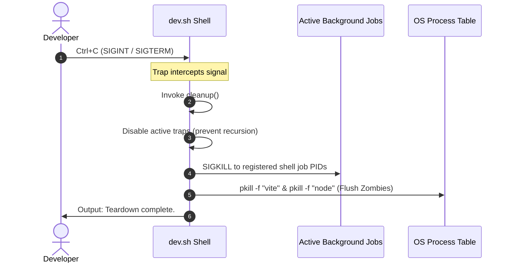

# Microservice Launcher & Process Orchestration

Kryneth Gateway is architectured as a suite of collaborative microservices alongside a React dashboard. To facilitate local velocity, the codebase provides an automated orchestration launcher script, `dev.sh`, that boots up the entire distributed application topology inside a single, unified terminal session.

---

## 1. Concurrency Orchestration Model

Managing seven concurrent application systems manually is complex and error-prone. The `dev.sh` shell script addresses this by executing all microservices inside concurrent, background processes using standard POSIX job control.

```
       [dev.sh Launcher Thread]
                  |
     +------------+------------+
     | (Background Forking &)  |
     |                         |
     ├── kryneth_auth          (Port 8084)
     ├── kryneth_gateway       (Port 8080)
     ├── kryneth_config        (Port 8085)
     ├── kryneth_cache         (Port 8081)
     ├── kryneth_compliance    (Port 8083)
     ├── kryneth_tracer        (Port 8082)
     └─┬ kryneth_dashboard     (Port 5173 / Vite Node)
```

Each service is launched as a background job by utilizing the trailing ampersand (`&`) operator in bash:

```bash
cargo run -p kryneth_auth &
cargo run -p kryneth_gateway &
cd kryneth_dashboard && npm run dev &
```

The script then calls `wait` at the bottom of the execution loop, suspending the main script thread while keeping the bash session active to intercept incoming termination signals.

---

## 2. The Zombie Worker Pruning Mechanism

When running high-concurrency systems (specifically Vite/Node.js servers and active Rust Cargo builds), standard shell terminations present an engineering challenge: **orphaned processes**.

If a developer terminates the main launcher shell using `Ctrl+C`, the parent shell exits, but active child processes can continue executing in the background as independent daemons. These "zombies" continue to consume memory and bind to network ports (such as `5173` or `8080`), triggering "Address already in use" (`EADDRINUSE`) errors during subsequent startup runs.

To guarantee workspace hygiene, `dev.sh` implements a robust **Signal Trapping and Process Pruning Engine**.



### Technical Implementation

The teardown pipeline relies on POSIX signal interceptors (`trap`):

```bash
# Cleanup function to safely kill all background processes on Ctrl+C
cleanup() {
    # Disable traps to prevent recursive trap calls
    trap - EXIT INT TERM
    echo "Shutting down Kryneth services..."
    
    # 1. Kill all child jobs spawned within this shell context
    local pids=$(jobs -p)
    if [ -n "$pids" ]; then
        kill $pids 2>/dev/null
    fi
    
    # 2. Hard purge Vite and Node processes to clear zombies
    pkill -f "vite" 2>/dev/null || true
    pkill -f "node" 2>/dev/null || true
    
    exit 0
}

# Trap SIGINT (Ctrl+C), SIGTERM, and general shell EXIT signals
trap cleanup EXIT INT TERM
```

### Deconstruction of the Pruning Sequence

1.  **Trap Registration**: The shell registers a `trap` matching the `EXIT`, `INT` (Interrupt, i.e. `Ctrl+C`), and `TERM` (Termination) signals. Any exit route routes into the custom `cleanup()` subroutine.
2.  **Infinite Recursion Prevention**: Inside `cleanup()`, the handler immediately unregisters itself (`trap - EXIT INT TERM`). This guarantees that any errors or signals triggered during the teardown sequence do not lead to an infinite recursive loop.
3.  **Targeted Job Termination**: Queries the active background jobs registered under the current shell context using `jobs -p` and terminates them using `kill`.
4.  **Process Table Pattern Pruning (`pkill`)**: Standard job signals can fail to reach nested Node.js sub-processes spawned by `npm run dev`. To ensure full cleanup, `pkill -f` scans the OS process table and terminates any process containing `vite` or `node` in its command line. This releases all TCP ports and leaves the workspace clean.
