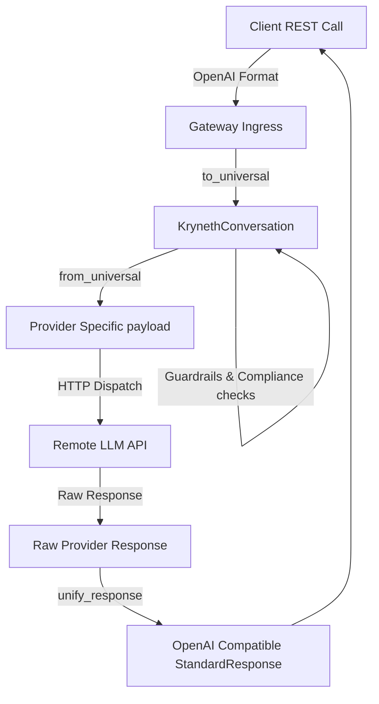

# Adding a New Upstream LLM Provider

This guide provides developers and open-source contributors with a step-by-step tutorial on how to add support for a new upstream LLM provider (such as Mistral, Grok, or a custom self-hosted inference endpoint) to Kryneth's L7 proxy routing pipeline.

---

## The Translation Architecture

Kryneth operates on a unified internal format (`KrynethConversation`). When a request enters the gateway, it is translated into this universal shape, processed by the guardrails, and then translated into the target provider's schema before invocation:



To add support for a new provider, you must implement the translation interface, register the provider's schema conversions, and bind it to the database configurations.

---

## Step 1: Implement the BaseTranslator Trait

All protocol mapping logic is encapsulated within **[translators.rs](file:///d:/Kryneth-Gateway-OSS/src/infrastructure/translators.rs)**. You must define a struct for your new provider and implement the `BaseTranslator` trait:

```rust
// Create your translator structure
pub struct MistralTranslator;

impl BaseTranslator for MistralTranslator {
    /// 1. Parse client payload into the internal Kryneth representation.
    fn to_universal(&self, payload: &mut [u8]) -> Result<KrynethConversation, AppError> {
        let req: MistralChatRequest = simd_json::from_slice(payload)
            .map_err(|e| AppError::TranslationError(format!("Mistral parse error: {}", e)))?;
        
        // Convert Mistral messages to KrynethMessage array
        let mut kryneth_messages = Vec::new();
        // ... (convert roles and contents) ...

        Ok(KrynethConversation {
            system_prompt: req.system_instruction,
            messages: kryneth_messages,
            tools: req.tools,
            temperature: req.temperature,
            top_p: req.top_p,
            max_tokens: req.max_tokens,
            stop: req.stop_sequences,
            stream: req.stream,
            model: req.model,
        })
    }

    /// 2. Convert internal Kryneth representation to your provider's payload structure.
    fn from_universal(&self, conv: &KrynethConversation) -> Result<serde_json::Value, AppError> {
        let mistral_req = MistralRequest {
            model: conv.model.clone().unwrap_or_else(|| "mistral-large".to_string()),
            messages: conv.messages.iter().map(to_mistral_msg).collect(),
            tools: conv.tools.clone(),
            temperature: conv.temperature,
            max_tokens: conv.max_tokens,
            // Map other fields
        };

        serde_json::to_value(mistral_req)
            .map_err(|e| AppError::TranslationError(format!("Mistral serialize error: {}", e)))
    }

    /// 3. Standardize raw JSON responses back to OpenAI-compatible formats.
    fn unify_response(&self, raw: serde_json::Value) -> Result<StandardResponse, AppError> {
        // Map raw response fields to StandardResponse (OpenAI completions format)
        Ok(serde_json::json!({
            "id": raw.get("id").unwrap_or(&serde_json::json!("msg-id")),
            "object": "chat.completion",
            "choices": [{
                "index": 0,
                "message": {
                    "role": "assistant",
                    "content": raw["choices"][0]["message"]["content"]
                },
                "finish_reason": "stop"
            }]
        }))
    }

    /// 4. Translate streaming tokens/deltas.
    fn unify_stream_chunk(&self, chunk: String) -> Result<StandardStreamChunk, AppError> {
        // Parse raw stream line delta and format as "data: { ...OpenAI chunk... }"
        Ok(chunk) 
    }
}
```

Register your struct in `translators.rs`'s module factory or routing entrypoint so the router can construct it.

---

## Step 2: Register Schema Conversions

If your provider uses tool schemas that differ from OpenAI standard tool schemas (similar to how Anthropic uses `input_schema` and `ToolUse` instead of `parameters` and `function`), you must add translation helpers to **[schema_mapper.rs](file:///d:/Kryneth-Gateway-OSS/src/infrastructure/schema_mapper.rs)**:

1.  Write a mapper to translate OpenAI JSON schemas into your provider's format:
    ```rust
    pub fn map_openai_tools_to_mistral(openai_tools: Option<Vec<Value>>) -> Option<Vec<Value>> {
        // Conversion logic mapping parameters to Mistral's tool schemas
    }
    ```
2.  Write a reverse mapper to translate your provider's tool-execution deltas or responses back into OpenAI compatible blocks:
    ```rust
    pub fn map_mistral_tool_calls_to_openai(raw_tool_calls: Vec<Value>) -> Option<Vec<Value>> {
        // Reverse mapping logic
    }
    ```
3.  Inject these helpers into your translator's `from_universal` and `unify_response` methods.

---

## Step 3: Add Provider to Enums & Routing Registries

To make your provider routable, you must bind it to the database structures and runtime registry maps:

### 1. Database Migrations (Enterprise Only)
If utilizing Kryneth Enterprise, add the new provider name to the checked database constraints. Update your PostgreSQL tables (`provider_keys`, `llm_model_key_bindings`):
```sql
ALTER TYPE provider_name_enum ADD VALUE 'mistral';
ALTER TYPE schema_format_enum ADD VALUE 'mistral';
```

### 2. Runtime Router Mapping
Add your translator binding inside the router dispatch code:
-   **File**: `src/infrastructure/llm_router.rs`
-   **Details**: Under the router's client mapping check, instantiate your new translator struct depending on the schema format matched:
    ```rust
    let translator: Arc<dyn BaseTranslator> = match target.schema_format.as_str() {
        "openai" => Arc::new(OpenAiTranslator),
        "anthropic" => Arc::new(AnthropicTranslator),
        "gemini" => Arc::new(GeminiTranslator),
        "mistral" => Arc::new(MistralTranslator),
        other => return Err(GatewayError::ConfigurationError(format!("Unsupported schema: {}", other))),
    };
    ```

### 3. Register Static Pricing Rates
-   **File**: **[billing.rs](file:///d:/Kryneth-Gateway-OSS/src/domain/billing.rs)**
-   **Details**: Add pricing lookup definitions inside `lookup_precautionary_rate` to establish the fallback billing limits:
    ```rust
    if p.contains("mistral") {
        return PrecautionaryRate {
            pricing_type: PricingType::TokenBased,
            input_cost_per_1m: 2.00,
            output_cost_per_1m: 6.00,
            per_request_buffer: 0.0,
            mcp_flat_fee: 0.0,
            agent_loop_multiplier: 1.0,
        };
    }
    ```
