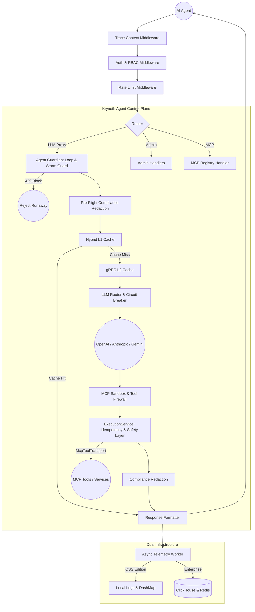
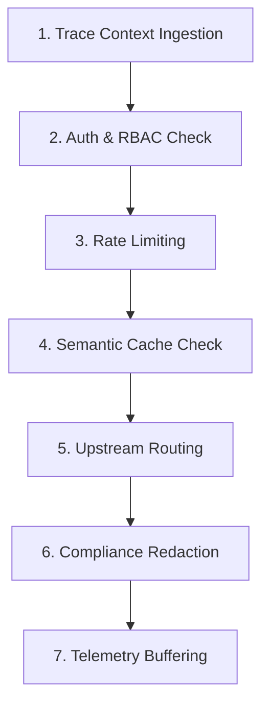

# Architecture & Core Proxy Pipeline

Kryneth is a blazingly fast, ultra-low latency Rust service built with the Axum framework and Tokio runtime. It acts as an **Agent Runtime Control Plane**—an intelligent reverse proxy sitting between your AI Agents and upstream LLM providers to orchestrate security, compliance, observability, semantic caching, and strict budget enforcement at the edge.



---

## 1. Stateless Proxy Execution Engineering

The Kryneth Gateway operates on a strictly stateless execution model. By design, no session state is persisted locally inside the application instance. This architecture permits seamless horizontal scaling across auto-scaling groups or Kubernetes clusters.

### Concurrent Async Execution Model

By utilizing the **Tokio asynchronous runtime** and the **Axum HTTP framework**, the gateway handles client connections inside lightweight green threads (Tasks). 
-   **Non-Blocking I/O**: Network requests are fanned out concurrently. Whenever a request awaits an upstream LLM provider's response, the Tokio thread-pool context-switches to execute other incoming requests, achieving massive scalability.
-   **Thread Safety**: Every intermediate state or metadata generated during the request lifecycle is attached directly to the request's connection context (via Axum's `Extensions`) rather than global shared structures, guaranteeing thread safety.

---

## 2. Lock-Free State Management via `arc_swap`

A primary challenge in high-performance gateways is hot-swapping configurations (such as model routing, API keys, or tenant rules) without introducing thread synchronization locks (`Mutex` or `RwLock`) that cause CPU thread contention.

Kryneth Gateway resolves this through a lock-free config container powered by `arc_swap::ArcSwap` in `kryneth_gateway/src/domain/models.rs`:

```rust
pub struct RoutingState {
    pub state: arc_swap::ArcSwap<
        std::collections::HashMap<String, std::collections::HashMap<String, ModelConfig>>,
    >,
}
```

### How `arc_swap` Eliminates Contention

-   **Read Operations (Zero Latency)**: Readers (incoming API requests) acquire an atomic, immutable pointer reference to the active `HashMap` via `.load()`. This operation is extremely fast and entirely lock-free, ensuring that concurrent requests read configurations at raw RAM speed.
-   **Write Operations (Hot Swapping)**: When the `kryneth_config` service publishes configuration changes via Redis Pub/Sub, the `config_subscriber` thread compiles the new routing map and atomically replaces the pointer in `RoutingState` via `.store()`.
-   **Zero Downtime**: Existing requests continue to execute against the old memory reference (kept alive via strong atomic reference counting) while new requests instantly see the updated configuration reference. No locks are acquired, and no request threads are blocked.

---

## 3. The 7-Stage Request Execution Pipeline

Every LLM completion request goes through a highly optimized, sequential 7-stage pipeline designed for low latency, compliance, and reliability.



### Stage 1: Trace Context Ingestion & Propagation
Injects a unique, immutable UUIDv4 `trace_id` and `session_id` into the request lifecycle. If downstream or upstream microservices are called, these IDs are propagated in the headers (`x-kryneth-trace-id`, `x-kryneth-session-id`), binding the transaction across the network.

### Stage 2: Authentication & RBAC Check
Validates the incoming API key or JWT token. In Enterprise setups, it checks the credentials against high-availability DB storage.

### Stage 3: Rate Limiting
Enforces rate quotas to prevent upstream model exhaustion or denial-of-service.

### Stage 4: Hybrid L1/L2 Semantic Cache Check
Searches the cache layers (L1 local Moka cache and L2 gRPC vector cache) to determine if an identical or semantically similar query was recently answered. On a hit, Kryneth returns the response instantly.

### Stage 5: Dynamic Upstream Routing & Mid-Stream SSE Failover Stitching
Evaluates prioritized targets from `routing.yaml`. If the primary provider fails before or during execution, Kryneth performs speculative recovery and hot-swaps to secondary targets seamlessly:
* **Pre-Request Failover**: Hot-swaps target providers in **~0.37ms** if a primary endpoint returns HTTP 5xx or connection errors.
* **Mid-Stream SSE Failover Stitching**: For active streaming responses (Server-Sent Events), Kryneth executes an allocation-free sliding window scanner (`has_error_signature`) over raw byte chunks to detect upstream error signatures (such as `"rate_limit"`, `"insufficient_funds"`, or `"billing_limit"`). If an error is detected mid-stream, Kryneth aborts the failing provider connection, consumes the next fallback target, and seamlessly stitches the fallback SSE stream to the active client HTTP response without dropping the client connection or restarting the generation.

### Stage 6: Pre/Post-Request Compliance & Policy Enforcer
Passes payloads to the compliance engine to detect and redact PII and block prompt injections.

### Stage 7: Telemetry Buffering
Writes telemetry payload logs asynchronously to an in-memory Tokio MPSC channel. Background threads consume the channel to bulk-insert telemetry records into ClickHouse without affecting client response latency.
